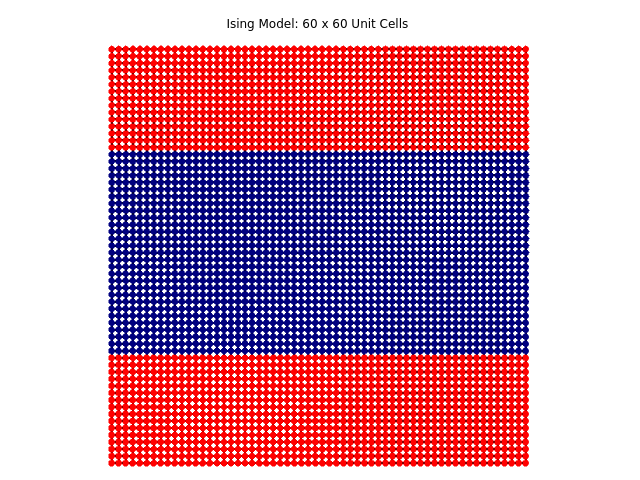

# MCSM
Monte Carlo for Statistical Mechanics

The goal of this project is to simulate physics in lattice systems. The first system we study here is the Ising model.
We can see very readily in our results that finding the ground state of the system is extremely unlikely unless we apply 
the concept of simulated annealing.

The ferromagnetic state can be obtained by allowing the Monte Carlo to accept energy changes that both lower the energy as well as leave the energy unchanged. This does not always yield a ferromagnetic state, though. There are states that cannot be changed by this acceptance criterion. These states involve thick stripes that run all the way across the system.

  

The ferromagnetic state either has all blue or all red sites, as shown here.

  

